<!-- Generated by tools/build_docs.py from sample.yml and flow/. Edit those, not this file. -->

[All samples](../../README.md) › Dates & time

# Business days between two dates

Count the business days between two dates, weekends and holidays left out, for France or another country: the public holidays come from an open data API, the days of your company from a file, and one PowerShell action counts.

**Reusable component** · Intermediate · Requires PAD only · Tested on PAD 2.72.183 · v1.0.1

[**Step-by-step setup**](SETUP.md) · [Download the sample (zip)](https://github.com/anne-automates/pad-samples/releases/download/business-days-between-two-dates-v1.0.1/business-days-between-two-dates-v1.0.1.zip) · [Changelog](CHANGELOG.md)

*For e-learning purposes only: try it in a test environment with the sample data, and review it before any real use. [Disclaimer](../../START-HERE.md#disclaimer)*

<br><sub>The message at the end of Main: France, 2026, public holidays from the API and company days from the file</sub>

## Try it

From the path that asks the least to the one that asks the most. Stop at the one you need.

| Path | You create | Needs | Time |
|---|---|---|---|
| **[1. Quick try](SETUP.md#1-quick-try)**<br>The whole method in one block pasted into Main, for France and the year 2026. No subflow, no input or output to create, no file. It calls the API, so it needs an internet connection. | Nothing | PAD only | 2 min |
| **[2. Reusable version](SETUP.md#2-reusable-version)**<br>The function and its example call, in a flow of their own. | 2 local subflows, 8 inputs, 9 outputs | PAD only | 15 min |
| **[3. In your own flow](#use-it-in-your-flow)**<br>Call `Count_Business_Days` from the flow you are building. | The subflow, its 10 variables and one CALL line | Your flow | Depends on your flow |

## Problem

A deadline, a service level or a pay period is counted in **business days**: no Saturday, no Sunday, no holiday.
PAD has no action for it: *Subtract dates* returns calendar days. And the holidays change every year and from one
country to the next: a list typed in the flow is wrong the following year.

## Solution

Two local functions, called one after the other. **`Get_Public_Holidays`** (4 inputs, 3 outputs) asks a public API
for the public holidays of a country: France in the sample, another country by changing its ISO code, a region by
adding its code. **`Count_Business_Days`** (4 inputs, 6 outputs) counts in **one *Run PowerShell script* action**:
the calendar days, minus the days off of the week, minus the holidays that fall on a working day. The days your
company adds (bridge days, closures) come from a CSV file and join the same list.

Both functions return a flag and a message and never stop the flow. On 51 test cases the count is the one Excel
gives with NETWORKDAYS.INTL.

**Techniques:** [Local function with a contract](../../TECHNIQUES.md#local-function) · [Errors returned, never thrown](../../TECHNIQUES.md#errors-as-outputs) · [One PowerShell action for what PAD cannot do](../../TECHNIQUES.md#powershell-script) · [A public API chosen for its licence](../../TECHNIQUES.md#open-data-api) · [JSON answers read field by field](../../TECHNIQUES.md#json-by-regex) · [Test cases replayed from a file](../../TECHNIQUES.md#test-cases-file)

## Use it in your flow

1. Create the local subflow `Count_Business_Days` and its 4 inputs and 6 outputs ([how](SETUP.md#2-reusable-version)).
2. Paste [`flow/2-Count_Business_Days.txt`](flow/2-Count_Business_Days.txt) into it (48 lines).
3. Call it. The example in `Main`:

```text
CALL Count_Business_Days in_loc_txt_StartDate: txt_StartDate in_loc_txt_EndDate: txt_EndDate in_loc_txt_WeekendDays: txt_WeekendDays in_loc_lst_Holidays: lst_Holidays out_loc_bool_Ok=> bool_Ok out_loc_num_BusinessDays=> num_BusinessDays out_loc_num_CalendarDays=> num_CalendarDays out_loc_num_WeekendDays=> num_WeekendDays out_loc_num_Holidays=> num_Holidays out_loc_txt_Error=> txt_Error
```

| Inputs | Type | Description | Example |
|---|---|---|---|
| `in_loc_txt_StartDate` | Text | First day of the period, as yyyy-MM-dd; it is counted | `2026-01-01` |
| `in_loc_txt_EndDate` | Text | Last day of the period, as yyyy-MM-dd; it is counted. Earlier than the start: the count is negative | `2026-12-31` |
| `in_loc_txt_WeekendDays` | Text | The days off of every week, English day names; empty = none | `Saturday,Sunday` |
| `in_loc_lst_Holidays` | List | The holidays, a list of yyyy-MM-dd texts; an empty list = none. An item listed twice counts once, an empty item is skipped | `['2026-01-01', '2026-12-25']` |

| Outputs | Type | Description | Example |
|---|---|---|---|
| `out_loc_bool_Ok` | Boolean | True when the function did its work | `True` |
| `out_loc_num_BusinessDays` | Number | Business days of the period, both dates included; negative when the period is given backwards | `247` |
| `out_loc_num_CalendarDays` | Number | Calendar days of the period, both dates included | `365` |
| `out_loc_num_WeekendDays` | Number | Days of the period that fall on a day off of the week | `104` |
| `out_loc_num_Holidays` | Number | Holidays inside the period that fall on a working day, each counted once | `14` |
| `out_loc_txt_Error` | Text | Why it failed; empty when out_loc_bool_Ok is True | `No public holiday returned for XX in 2026: the country or the year is not covered by the API` |

> [!TIP]
> `Count_Business_Days` never stops the flow. Test `out_loc_bool_Ok` after the call and read `out_loc_txt_Error` when it is False.

1. Create the local subflow `Get_Public_Holidays` and its 4 inputs and 3 outputs ([how](SETUP.md#2-reusable-version)).
2. Paste [`flow/3-Get_Public_Holidays.txt`](flow/3-Get_Public_Holidays.txt) into it (64 lines).
3. Call it. The example in `Main`:

```text
CALL Get_Public_Holidays in_loc_txt_CountryCode: txt_CountryCode in_loc_txt_SubdivisionCode: txt_SubdivisionCode in_loc_txt_StartDate: txt_StartDate in_loc_txt_EndDate: txt_EndDate out_loc_bool_Ok=> bool_HolidaysOk out_loc_lst_Holidays=> lst_PublicHolidays out_loc_txt_Error=> txt_Error
```

| Inputs | Type | Description | Example |
|---|---|---|---|
| `in_loc_txt_CountryCode` | Text | ISO code of the country, two capital letters, one of the 36 countries of the API | `FR` |
| `in_loc_txt_SubdivisionCode` | Text | Code of a region whose own days are added to the nationwide ones; empty = none | `FR-GE-MO` |
| `in_loc_txt_StartDate` | Text | First day of the period, as yyyy-MM-dd; it is counted | `2026-01-01` |
| `in_loc_txt_EndDate` | Text | Last day of the period, as yyyy-MM-dd; it is counted. Earlier than the start: the count is negative | `2026-12-31` |

| Outputs | Type | Description | Example |
|---|---|---|---|
| `out_loc_bool_Ok` | Boolean | True when the function did its work | `True` |
| `out_loc_lst_Holidays` | List | The public holidays of every year the period touches, as yyyy-MM-dd texts; empty when out_loc_bool_Ok is False | `['2026-01-01', '2026-04-06', ...]` |
| `out_loc_txt_Error` | Text | Why it failed; empty when out_loc_bool_Ok is True | `No public holiday returned for XX in 2026: the country or the year is not covered by the API` |

> [!TIP]
> `Get_Public_Holidays` never stops the flow. Test `out_loc_bool_Ok` after the call and read `out_loc_txt_Error` when it is False.

## How it works

```mermaid
flowchart TB
  subgraph Main["<b>Main</b> · main"]
    direction LR
    Main_1["1. Variables"]
    style Main_1 fill:#57FFE1,stroke:#57606a,color:#1f2328
    Main_2["2. Source 1, the file"]
    style Main_2 fill:#C6E0B4,stroke:#57606a,color:#1f2328
    Main_1 --> Main_2
    Main_3["3. Source 2, the API"]
    style Main_3 fill:#C6E0B4,stroke:#57606a,color:#1f2328
    Main_2 --> Main_3
    Main_4["4. Count"]
    style Main_4 fill:#D9C3E9,stroke:#57606a,color:#1f2328
    Main_3 --> Main_4
    Main_5["5. Guard"]
    style Main_5 fill:#F4B6B6,stroke:#57606a,color:#1f2328
    Main_4 --> Main_5
    Main_6["6. Output"]
    style Main_6 fill:#FFD966,stroke:#57606a,color:#1f2328
    Main_5 --> Main_6
  end
  subgraph Count_Business_Days["<b>Count_Business_Days</b> · local function"]
    direction LR
    Count_Business_Days_1["1. Outputs initialised"]
    style Count_Business_Days_1 fill:#57FFE1,stroke:#57606a,color:#1f2328
    Count_Business_Days_2["2. The four inputs travel to the script in one text"]
    style Count_Business_Days_2 fill:#C6E0B4,stroke:#57606a,color:#1f2328
    Count_Business_Days_1 --> Count_Business_Days_2
    Count_Business_Days_3["3. Count"]
    style Count_Business_Days_3 fill:#D9C3E9,stroke:#57606a,color:#1f2328
    Count_Business_Days_2 --> Count_Business_Days_3
    Count_Business_Days_4["4. Guards"]
    style Count_Business_Days_4 fill:#F4B6B6,stroke:#57606a,color:#1f2328
    Count_Business_Days_3 --> Count_Business_Days_4
    Count_Business_Days_5["5. Outputs"]
    style Count_Business_Days_5 fill:#FFD966,stroke:#57606a,color:#1f2328
    Count_Business_Days_4 --> Count_Business_Days_5
  end
  subgraph Get_Public_Holidays["<b>Get_Public_Holidays</b> · local function"]
    direction LR
    Get_Public_Holidays_1["1. Outputs initialised"]
    style Get_Public_Holidays_1 fill:#57FFE1,stroke:#57606a,color:#1f2328
    Get_Public_Holidays_2["2. Guards"]
    style Get_Public_Holidays_2 fill:#F4B6B6,stroke:#57606a,color:#1f2328
    Get_Public_Holidays_1 --> Get_Public_Holidays_2
    Get_Public_Holidays_3["3. One call per year"]
    style Get_Public_Holidays_3 fill:#C6E0B4,stroke:#57606a,color:#1f2328
    Get_Public_Holidays_2 --> Get_Public_Holidays_3
    Get_Public_Holidays_4["4. Outputs"]
    style Get_Public_Holidays_4 fill:#FFD966,stroke:#57606a,color:#1f2328
    Get_Public_Holidays_3 --> Get_Public_Holidays_4
  end
  Main == "CALL · 4 in · 6 out" ==> Count_Business_Days
  Main == "CALL · 4 in · 3 out" ==> Get_Public_Holidays
```



`Count_Business_Days`, region by region:

1. **Outputs initialised**: every path leaves them defined
2. **The four inputs travel to the script in one text**
3. **Count**: one script action for the calendar days, the days off and the holidays
4. **Guards**: the action never fails by itself, the script answers OK or ERROR with a message
5. **Outputs**: the count carries the sign of the period, the details describe it

## Design choices

Measured 2026-10-06, in the designer at a run delay of 100 ms, for the year 2026.

| Approach | Time | Result | Verdict |
|---|---|---|---|
| A loop over every day (*Add to datetime* and the `.DayOfWeek` property) | 282 s | Saturdays and Sundays only. No holidays. | Rejected: three actions per day, so the time grows with the period. |
| The same rules as the function written with about 50 native actions | 26 s with a calendar of 11 lines | The same counts on the 59 test cases. | Rejected: about a second more for each holiday. The way to go where script actions are blocked. |
| **Chosen: one *Run PowerShell script* action in a local function** | 5 s, with or without holidays, for one week as for thirty years | The same counts on the 59 test cases, the numbers of NETWORKDAYS.INTL on 51. | A count paid action by action costs time. In one script action it takes about 1 s; the rest is the function around it. |

## Where the holidays come from: a file, a public API, or both

`Count_Business_Days` takes a list of dates and does not care where it comes from. Three sources, each run in the
designer on 2026-10-07 for the year 2026. The public holidays of France given by the API (11 dates) are the same
as those of the official French calendar (`calendrier.api.gouv.fr`).

| Source | What you maintain | Result for 2026 (261 weekdays) | Good for |
|---|---|---|---|
| A. A file with every day off (`Holidays_2026.csv`, 11 lines) | Every date, every year | 254 business days: 7 holidays on a working day | A first version; a calendar that follows no country |
| B. The public API (`Get_Public_Holidays`, country `FR`) | Nothing | 252 business days: 9 of the 11 public holidays of France fall on a working day | Public holidays that stay right every year |
| B. The same API, another country (`DE`) | Nothing | 254 business days: 7 of the 9 nationwide holidays of Germany fall on a working day | One flow for several countries |
| B. The same API with a region (`FR` and `FR-GE-MO`, Moselle) | Nothing | 251 business days: 13 dates, Good Friday is added and 26 December is a Saturday | Regions with days of their own |
| C. Both: the API (`FR`) and a file of company days (`Company_Days_2026.csv`, 6 lines) | Only the days your company adds | 247 business days: 9 public holidays and 5 company days; 25 December is in both and counted once | The complete answer: bridge days and closures on top of the public holidays |

How, in short:

1. `Main` does C. Its first region holds the three settings: `txt_CountryCode`, `txt_SubdivisionCode` and `txt_CompanyDaysFile`.
2. A file only: empty `txt_CountryCode` and give your file in `txt_CompanyDaysFile` (`C:\Work\Calendar\Holidays_2026.csv` in the sample). One day per line, in a column named `Date`.
3. The API only: give the ISO code of the country in `txt_CountryCode` and empty `txt_CompanyDaysFile`.
4. Another country: change `FR` to one of the 36 codes of the API, in capitals: `DE`, `BE`, `ES`, `IT`, `NL`, `PT`, `PL`, `CH`, `AT`, `IE`, `LU` ... The full list: `https://openholidaysapi.org/Countries`.
5. A region: `txt_SubdivisionCode` adds the days of a region to the nationwide ones. `FR-GE-MO` (Moselle) adds Good Friday and 26 December, `DE-BY` four Bavarian days. The codes: `https://openholidaysapi.org/Subdivisions?countryIsoCode=FR`.
6. Another API: only the address and the two regular expressions of region 3 of `Get_Public_Holidays` change. Two others were looked at: the official French calendar (`calendrier.api.gouv.fr`: France and its overseas territories only, Licence Ouverte) and Nager.Date (200 countries, but its terms ask for a sponsorship for commercial use).

Step by step: [Where the holidays come from: a file, a public API, or both](SETUP.md#4-where-the-holidays-come-from-a-file-a-public-api-or-both).

## Performance

- Tested run of 2026-10-07 (designer, run delay 100 ms): Main reads the file, calls the API for France, counts the year 2026 and shows its message in 21.1 s.
- Quick try of 2026-10-07 (designer, run delay 100 ms): the API called for France and the year 2026 counted in 13.7 s, message included.
- `Count_Business_Days` at a run delay of 100 ms: 5.0 to 5.3 s per call, with or without holidays, from one week to thirty years (eight calls measured on 2026-10-06). The script action alone answers in about 1.1 s; the rest is the 18 native actions of the function around it.
- `Get_Public_Holidays` at a run delay of 1 ms: 2.7 to 3.5 s for one year (one call to the API), 10.7 s for the eleven years 2020 to 2030.
- Tests: 59 calls of `Count_Business_Days` in 4 min 29 s at a run delay of 1 ms.
- Every time was measured in the designer, which draws each action on screen (about 0.24 s per action at a run delay of 100 ms). A run from the console was not measured.

## Limits

- The public holidays come from OpenHolidays API (`openholidaysapi.org`), an open data project: ODbL licence, free of charge, commercial use allowed, no key. It promises no availability. When it does not answer, `Get_Public_Holidays` says so and `Main` stops with the message; that case was not tested. Keep a file for the days without network.
- The API covers 36 countries (Europe, Brazil, Mexico, South Africa) and years from 2020. For France, 2030 was answered and 2035 came back empty on 2026-10-07. An empty year is reported as an error, never counted as a year without holidays.
- From the API only public, full-day, nationwide days are kept, plus those of the subdivision asked. School holidays and half days are left out.
- The answer of the API is read by regular expressions that expect its present layout. If the layout changes, the function reports that no holiday was returned.
- Script actions can be blocked by a data loss prevention (DLP) policy of the tenant, which can also restrict the addresses *Invoke web service* may call. The version of the count in native actions is not part of this sample.
- Dates are texts written `yyyy-MM-dd`. Convert a datetime variable first (*Convert datetime to text*, custom format `yyyy-MM-dd`). A date with a time, or written `2026-3-2`, is refused with a message.
- Both dates are counted, as in NETWORKDAYS.INTL. For the days elapsed after a start date, give the day after it as the start.
- Days off are whole days, the same every week. Half days, shifts and a calendar that changes inside the period are not handled.
- A value that holds the character `|` is refused by `Count_Business_Days`: it separates the values given to the script. The script uses nothing beyond Windows PowerShell 5.1.
- The Flow checker of the designer lists outputs of the functions as unused variables: an output is set, never read. Nothing to fix.
- `Count_Business_Days` was tested on dates from 1949 to 2055, on a PC set to English (United States).

## Files

| Subflow | Scope | Lines | Role |
|---|---|---|---|
| [`Main`](flow/1-Main.txt) | Main | 55 | The complete example: reads the company days from a file and the public holidays of a country from the API, merges them, calls the count, shows the result and its sources. |
| [`Count_Business_Days`](flow/2-Count_Business_Days.txt) | Local | 48 | The count: two dates, the days off of the week and a list of holidays in; the count, three details, a flag and a message out. One script action. Never stops the flow. |
| [`Get_Public_Holidays`](flow/3-Get_Public_Holidays.txt) | Local | 64 | The public holidays of a country for the years of a period, from a public API: a country code, an optional region and two dates in; a list of dates, a flag and a message out. Never stops the flow. |
| [`Quick_Try`](flow/4-Quick_Try.txt) | Global | 77 | The quick try: the API call and the count in one block, without the functions. *(optional)* |
| [`Tests`](flow/5-Tests.txt) | Global | 56 | Replays the 59 cases of Business_Days_Cases.csv through Count_Business_Days and writes a report next to it: one line per case, the total at the end. Run it with Run from here on its first action. *(optional)* |

- Sample files, in [`input/`](input/): `Business_Days_Cases.csv`, `Company_Days_2026.csv`, `Holidays_2026.csv`
- Output of the test run, in [`expected/`](expected/): `tests-report.txt`

## Tested on

| PAD version | Date | Path | Result |
|---|---|---|---|
| 2.72.183 | 2026-10-07 | Full flow (file and API for France) | Pass |
| 2.72.183 | 2026-10-07 | Quick try | Pass |
| 2.72.183 | 2026-10-07 | File only, API only, Germany, Moselle | Pass |
| 2.72.183 | 2026-10-07 | Tests (59 cases) | Pass |

Authors: Anne (AI agent), HyperAutomatisation · [Changelog](CHANGELOG.md) · [Report a problem](https://github.com/anne-automates/pad-samples/issues/new?template=sample-does-not-work.yml&title=%5Bbusiness-days-between-two-dates%5D+)
