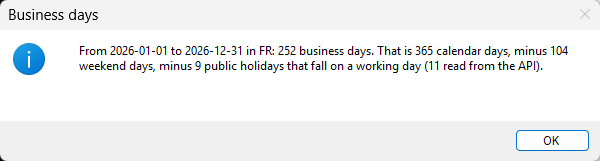
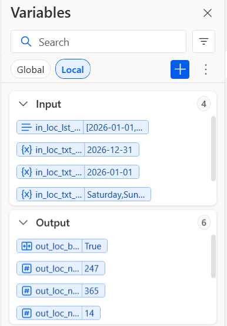
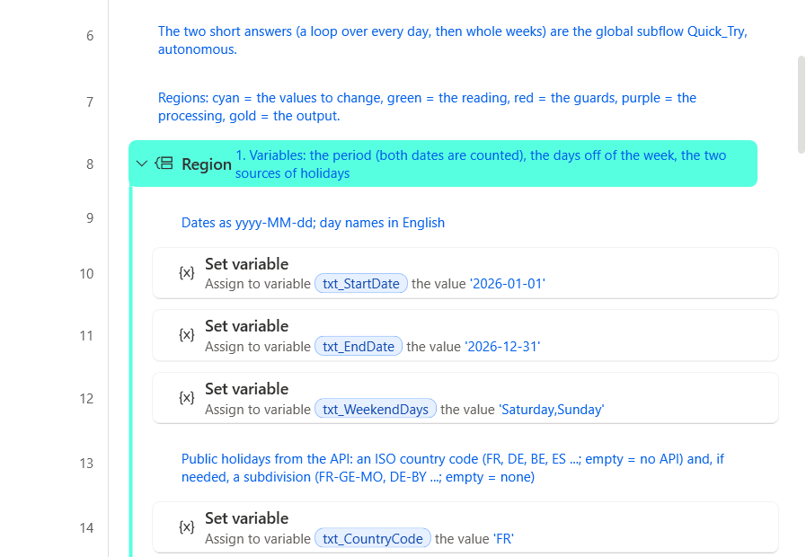
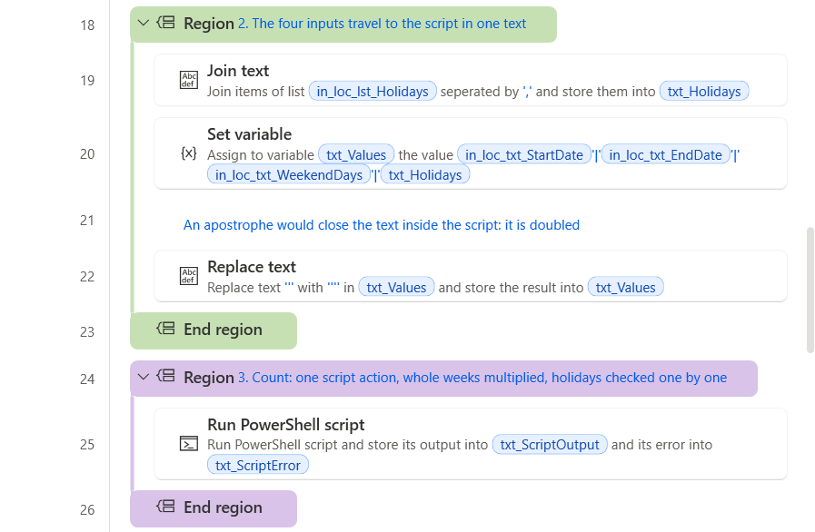
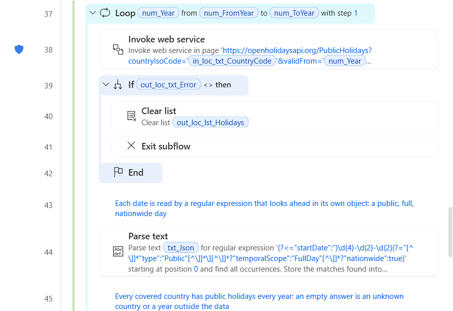
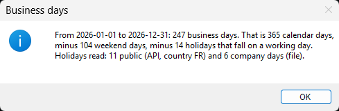
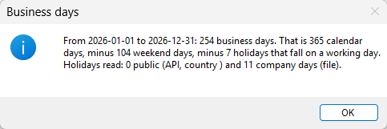
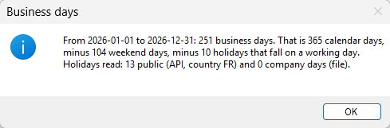

<!-- Generated by tools/build_docs.py from sample.yml and flow/. Edit those, not this file. -->

[All samples](../../README.md) › [Business days between two dates](README.md) › Setup

# Set up: Business days between two dates

Tested on PAD 2.72.183 · v1.0.1

*For e-learning purposes only: try it in a test environment with the sample data, and review it before any real use. [Disclaimer](../../START-HERE.md#disclaimer)*

From the path that asks the least to the one that asks the most. Stop at the one you need.

| Path | You create | Needs | Time |
|---|---|---|---|
| **[1. Quick try](#1-quick-try)**<br>The whole method in one block pasted into Main, for France and the year 2026. No subflow, no input or output to create, no file. It calls the API, so it needs an internet connection. | Nothing | PAD only | 2 min |
| **[2. Reusable version](#2-reusable-version)**<br>The function and its example call, in a flow of their own. | 2 local subflows, 8 inputs, 9 outputs | PAD only | 15 min |
| **[3. In your own flow](#3-in-your-own-flow)**<br>Call `Count_Business_Days` from the flow you are building. | The subflow, its 10 variables and one CALL line | Your flow | Depends on your flow |

## 1. Quick try

The whole method in one block pasted into Main, for France and the year 2026. No subflow, no input or output to create, no file. It calls the API, so it needs an internet connection. Needs PAD only.

### 1.1 Paste the block into Main

**+ New flow**, any name, **Create**. Click the empty canvas of `Main`, **Ctrl+V** the block of [`flow/4-Quick_Try.txt`](flow/4-Quick_Try.txt). Check: 77 lines, Errors pane empty.

<details><summary>The code (77 lines)</summary>

```text
# subflow: Quick_Try (global)
# Business days between two dates - the whole method in one block: nothing to create, no file.
# The public holidays of the country come from a public API (OpenHolidays API, open data), then one Run PowerShell script
# action counts: the calendar days, minus the days off of the week, minus the holidays that fall on a working day.
# The reusable version does the same in two local functions, Get_Public_Holidays and Count_Business_Days, and adds
# the days of your company from a file and the days of a region.
# Regions: cyan = the values to change, red = the guards, green = the reading, purple = the processing, gold = the output.
@@regionColor: '#57FFE1'
**REGION 1. Variables: the period (both dates are counted), the days off of the week, the country
# Dates as yyyy-MM-dd; day names in English; an ISO country code in capitals (FR, DE, BE, ES, IT ...)
SET txt_StartDate TO $'''2026-01-01'''
SET txt_EndDate TO $'''2026-12-31'''
SET txt_WeekendDays TO $'''Saturday,Sunday'''
SET txt_CountryCode TO $'''FR'''
**ENDREGION
@@regionColor: '#F4B6B6'
**REGION 2. Guard: the years of the period, read only from two yyyy-MM-dd dates
Text.ParseText.RegexParse Text: txt_StartDate TextToFind: $'''^\\d{4}(?=-\\d{2}-\\d{2}$)''' StartingPosition: 0 IgnoreCase: False Matches=> lst_FromYear
Text.ParseText.RegexParse Text: txt_EndDate TextToFind: $'''^\\d{4}(?=-\\d{2}-\\d{2}$)''' StartingPosition: 0 IgnoreCase: False Matches=> lst_ToYear
IF lst_FromYear.Count = 0 OR lst_ToYear.Count = 0 THEN
    Display.ShowMessageDialog.ShowMessage Title: $'''Business days''' Message: $'''Dates must be written yyyy-MM-dd: %txt_StartDate% %txt_EndDate%''' Icon: Display.Icon.ErrorIcon Buttons: Display.Buttons.OK DefaultButton: Display.DefaultButton.Button1 IsTopMost: True
    EXIT Code: 1
END
Text.ToNumber Text: lst_FromYear[0] Number=> num_FromYear
Text.ToNumber Text: lst_ToYear[0] Number=> num_ToYear
# A period given backwards: its two years change places
IF num_FromYear > num_ToYear THEN
    SET num_Swap TO num_FromYear
    SET num_FromYear TO num_ToYear
    SET num_ToYear TO num_Swap
END
**ENDREGION
@@regionColor: '#C6E0B4'
**REGION 3. Public holidays: one call per year, the nationwide full days read by a regular expression
Variables.CreateNewList List=> lst_Holidays
LOOP num_Year FROM num_FromYear TO num_ToYear STEP 1
    SET bool_Answered TO True
    Web.InvokeWebService.InvokeWebService Url: $'''https://openholidaysapi.org/PublicHolidays?countryIsoCode=%txt_CountryCode%&validFrom=%num_Year%-01-01&validTo=%num_Year%-12-31''' Method: Web.Method.Get Accept: $'''text/json''' ContentType: $'''application/json''' ConnectionTimeout: 30 FollowRedirection: True ClearCookies: False FailOnErrorStatus: True UserAgent: $'''PAD-flow/1.0 (Power Automate Desktop)''' Encoding: Web.Encoding.AutoDetect AcceptUntrustedCertificates: False TrimRequestBody: True Response=> txt_Json StatusCode=> num_HttpCode
    ON ERROR REPEAT 3 TIMES WAIT 2 RetryType: RetryType.Exponential MinInterval: 2 MaxInterval: 60
    ON ERROR
        SET bool_Answered TO False
    END
    IF bool_Answered = False THEN
        Display.ShowMessageDialog.ShowMessage Title: $'''Business days''' Message: $'''No answer from the holidays API for %txt_CountryCode% in %num_Year%''' Icon: Display.Icon.ErrorIcon Buttons: Display.Buttons.OK DefaultButton: Display.DefaultButton.Button1 IsTopMost: True
        EXIT Code: 1
    END
    Text.ParseText.RegexParse Text: txt_Json TextToFind: $'''(?<=\"startDate\":\")\\d{4}-\\d{2}-\\d{2}(?=\"[^\\]]*\"type\":\"Public\"[^\\]]*\\][^\\]]*?\"temporalScope\":\"FullDay\"[^\\]]*?\"nationwide\":true)''' StartingPosition: 0 IgnoreCase: False Matches=> lst_Nationwide
    # Every covered country has public holidays every year: an empty answer is an unknown country or a year outside the data
    IF lst_Nationwide.Count = 0 THEN
        Display.ShowMessageDialog.ShowMessage Title: $'''Business days''' Message: $'''No public holiday returned for %txt_CountryCode% in %num_Year%: the country or the year is not covered by the API''' Icon: Display.Icon.ErrorIcon Buttons: Display.Buttons.OK DefaultButton: Display.DefaultButton.Button1 IsTopMost: True
        EXIT Code: 1
    END
    Variables.MergeLists FirstList: lst_Holidays SecondList: lst_Nationwide OutputList=> lst_Holidays
END
**ENDREGION
@@regionColor: '#D9C3E9'
**REGION 4. Count: the inputs travel in one text, one script action counts
Text.JoinText.JoinWithCustomDelimiter List: lst_Holidays CustomDelimiter: $''',''' Result=> txt_Holidays
SET txt_Values TO $'''%txt_StartDate%|%txt_EndDate%|%txt_WeekendDays%|%txt_Holidays%'''
# An apostrophe would close the text inside the script: it is doubled
Text.Replace.ReplaceText Text: txt_Values TextToFind: $'''\'''' IgnoreCase: False ReplaceWith: $'''\'\'''' ActivateEscapeSequences: False ComparisonType: Text.TextComparisonType.Ordinal Result=> txt_Values
Scripting.RunPowershellScript.RunScript Script: $'''# Business days between two dates: one text in, one line out.
# In : start|end|days off|holidays (dates as yyyy-MM-dd, holidays separated by commas).
# Out: OK|business days|calendar days|weekend days|holidays|   or   ERROR|0|0|0|0|message
# Dates are read with the invariant culture and compared as real dates: nothing depends on the regional settings.
# ASCII only on purpose: the same text lives inside a flow and inside a PowerShell action.
$ErrorActionPreference = \'Stop\'
$inv = [System.Globalization.CultureInfo]::InvariantCulture
$none = [System.Globalization.DateTimeStyles]::None
$answer = \'ERROR|0|0|0|0|\'
try {
    $values = \'%txt_Values%\'.Split(\'|\')
    if ($values.Count -ne 4) { throw \'A value holds the character | : it separates the values given to the script\' }
    $day = [datetime]::MinValue
    if (-not [datetime]::TryParseExact($values[0], \'yyyy-MM-dd\', $inv, $none, [ref]$day)) { throw (\'Start date is not a yyyy-MM-dd date: \' + $values[0]) }
    $from = $day
    if (-not [datetime]::TryParseExact($values[1], \'yyyy-MM-dd\', $inv, $none, [ref]$day)) { throw (\'End date is not a yyyy-MM-dd date: \' + $values[1]) }
    $to = $day
    # The days off: every word must be one of the seven English day names, once
    $names = \'Monday\', \'Tuesday\', \'Wednesday\', \'Thursday\', \'Friday\', \'Saturday\', \'Sunday\'
    $off = @{}
    foreach ($word in [regex]::Matches($values[2], \'[A-Za-z]+\')) {
        $name = $names | Where-Object { $_ -eq $word.Value }
        if (-not $name -or $off.ContainsKey($name)) { throw (\'Weekend days must be English day names such as Saturday,Sunday: \' + $values[2]) }
        $off[$name] = $true
    }
    # A period given backwards is counted forwards; the sign is turned at the end
    $sign = 1
    if ($from -gt $to) { $day = $from; $from = $to; $to = $day; $sign = -1 }
    # Whole weeks are multiplied; only the days left, six at most, are visited
    $calendar = ($to - $from).Days + 1
    $weeks = [int][Math]::Floor($calendar / 7)
    $work = $weeks * (7 - $off.Count)
    for ($i = 0; $i -lt ($calendar - 7 * $weeks); $i++) {
        if (-not $off.ContainsKey($from.AddDays($i).DayOfWeek.ToString())) { $work++ }
    }
    # Holidays: counted once, inside the period, and only when they fall on a working day
    $seen = @{}
    $holidays = 0
    foreach ($item in $values[3].Split(\',\')) {
        $text = $item.Trim()
        if ($text -eq \'\') { continue }
        if (-not [datetime]::TryParseExact($text, \'yyyy-MM-dd\', $inv, $none, [ref]$day)) { throw (\'A holiday is not a yyyy-MM-dd date: \' + $text) }
        if ($day -ge $from -and $day -le $to -and -not $seen.ContainsKey($text)) {
            $seen[$text] = $true
            if (-not $off.ContainsKey($day.DayOfWeek.ToString())) { $holidays++ }
        }
    }
    $answer = \'OK|\' + (($work - $holidays) * $sign) + \'|\' + $calendar + \'|\' + ($calendar - $work) + \'|\' + $holidays + \'|\'
} catch { $answer = \'ERROR|0|0|0|0|\' + $_.Exception.Message }
[Console]::Out.Write($answer)''' ScriptOutput=> txt_ScriptOutput ScriptError=> txt_ScriptError
**ENDREGION
@@regionColor: '#F4B6B6'
**REGION 5. Guard: the action never fails by itself, the script answers OK or ERROR with a message
IF txt_ScriptError <> $'''''' THEN
    Display.ShowMessageDialog.ShowMessage Title: $'''Business days''' Message: $'''Count failed: %txt_ScriptError%''' Icon: Display.Icon.ErrorIcon Buttons: Display.Buttons.OK DefaultButton: Display.DefaultButton.Button1 IsTopMost: True
    EXIT Code: 1
END
Text.SplitText.SplitWithDelimiter Text: txt_ScriptOutput CustomDelimiter: $'''|''' IsRegEx: False Result=> lst_Answer
IF lst_Answer.Count < 6 THEN
    Display.ShowMessageDialog.ShowMessage Title: $'''Business days''' Message: $'''No answer from the script: %txt_ScriptOutput%''' Icon: Display.Icon.ErrorIcon Buttons: Display.Buttons.OK DefaultButton: Display.DefaultButton.Button1 IsTopMost: True
    EXIT Code: 1
END
IF lst_Answer[0] <> $'''OK''' THEN
    Display.ShowMessageDialog.ShowMessage Title: $'''Business days''' Message: $'''Count failed: %lst_Answer[5]%''' Icon: Display.Icon.ErrorIcon Buttons: Display.Buttons.OK DefaultButton: Display.DefaultButton.Button1 IsTopMost: True
    EXIT Code: 1
END
**ENDREGION
@@regionColor: '#FFD966'
**REGION 6. Output: the count and how it was reached
Display.ShowMessageDialog.ShowMessage Title: $'''Business days''' Message: $'''From %txt_StartDate% to %txt_EndDate% in %txt_CountryCode%: %lst_Answer[1]% business days. That is %lst_Answer[2]% calendar days, minus %lst_Answer[3]% weekend days, minus %lst_Answer[4]% public holidays that fall on a working day (%lst_Holidays.Count% read from the API).''' Icon: Display.Icon.Information Buttons: Display.Buttons.OK DefaultButton: Display.DefaultButton.Button1 IsTopMost: True
**ENDREGION
```

</details>

### 1.2 Run and check

**Run**. Expected:

- After about 14 s, a message: From 2026-01-01 to 2026-12-31 in FR: 252 business days. That is 365 calendar days, minus 104 weekend days, minus 9 public holidays that fall on a working day (11 read from the API).

<br><sub>The message at the end of the quick try</sub>

The values to change are in the first region of `Quick_Try` (cyan):

| Variable | Value in the sample | What it is |
|---|---|---|
| `txt_StartDate` | `2026-01-01` | Dates as yyyy-MM-dd; day names in English; an ISO country code in capitals (FR, DE, BE, ES, IT ...) |
| `txt_EndDate` | `2026-12-31` | Dates as yyyy-MM-dd; day names in English; an ISO country code in capitals (FR, DE, BE, ES, IT ...) |
| `txt_WeekendDays` | `Saturday,Sunday` | Dates as yyyy-MM-dd; day names in English; an ISO country code in capitals (FR, DE, BE, ES, IT ...) |
| `txt_CountryCode` | `FR` | Dates as yyyy-MM-dd; day names in English; an ISO country code in capitals (FR, DE, BE, ES, IT ...) |

> [!NOTE]
> Change txt_CountryCode in the first region to another country of the API (DE, BE, ES, IT ...), or the two dates, and run again.

## 2. Reusable version

### 2.1 Prepare the files

- Copy [`input/*`](input/) into `C:\Work\Calendar`. Create the folder first. Company_Days_2026.csv holds the six company days read by Main. Holidays_2026.csv is a calendar with every day off, for the file-only setting and for the optional subflow Tests, which also reads Business_Days_Cases.csv.

### 2.2 Create the flow and its subflows

**+ New flow**, name `Business days between two dates`, **Create**.
 Then for each subflow: **Subflows** above the canvas › **New**, name, scope, **Save**.

| Subflow name | Scope | Role |
|---|---|---|
| `Count_Business_Days` | Local | The count: two dates, the days off of the week and a list of holidays in; the count, three details, a flag and a message out. One script action. Never stops the flow. |
| `Get_Public_Holidays` | Local | The public holidays of a country for the years of a period, from a public API: a country code, an optional region and two dates in; a list of dates, a flag and a message out. Never stops the flow. |
| `Tests` | Global | Replays the 59 cases of Business_Days_Cases.csv through Count_Business_Days and writes a report next to it: one line per case, the total at the end. Run it with Run from here on its first action. *(optional)* |

> [!WARNING]
> The scope **Local** is easily lost while you type the name. Check it just before **Save**.

Pictures: [Create a subflow](../../docs/create-a-subflow.md).

### 2.3 Create the input and output variables

They must exist before the paste: the code uses them. Type the names exactly.

In `Count_Business_Days`: **Variables** › **Local** › **+** › **Input** or **Output**, the name only.

```text
in_loc_txt_StartDate
in_loc_txt_EndDate
in_loc_txt_WeekendDays
in_loc_lst_Holidays
out_loc_bool_Ok
out_loc_num_BusinessDays
out_loc_num_CalendarDays
out_loc_num_WeekendDays
out_loc_num_Holidays
out_loc_txt_Error
```

In `Get_Public_Holidays`: **Variables** › **Local** › **+** › **Input** or **Output**, the name only.

```text
in_loc_txt_CountryCode
in_loc_txt_SubdivisionCode
in_loc_txt_StartDate
in_loc_txt_EndDate
out_loc_bool_Ok
out_loc_lst_Holidays
out_loc_txt_Error
```

<br><sub>The Variables pane of Count_Business_Days, section Local: Input 4, Output 6</sub>

Descriptions and examples: [the contract](README.md#use-it-in-your-flow). Pictures: [Create input and output variables](../../docs/create-variables.md).

### 2.4 Paste the code

Open the tab of the subflow, click its empty canvas, **Ctrl+V**.

**`Main`** ← [`flow/1-Main.txt`](flow/1-Main.txt). Check: 55 lines, Errors pane empty.

<details><summary>The code (55 lines)</summary>

```text
# subflow: Main (global)
# Business days between two dates - the complete example: the holidays come from two sources, then one function counts.
# The public holidays of a country come from a public API (Get_Public_Holidays: France here, another ISO code for another country).
# The days your company adds come from a CSV file. Either source can be left empty: a file alone, the API alone, or both.
# Count_Business_Days then counts the period: dates, days off and holidays in; the count and its details out.
# The two short answers (a loop over every day, then whole weeks) are the global subflow Quick_Try, autonomous.
# Regions: cyan = the values to change, green = the reading, red = the guards, purple = the processing, gold = the output.
@@regionColor: '#57FFE1'
**REGION 1. Variables: the period (both dates are counted), the days off of the week, the two sources of holidays
# Dates as yyyy-MM-dd; day names in English
SET txt_StartDate TO $'''2026-01-01'''
SET txt_EndDate TO $'''2026-12-31'''
SET txt_WeekendDays TO $'''Saturday,Sunday'''
# Public holidays from the API: an ISO country code (FR, DE, BE, ES ...; empty = no API) and, if needed, a subdivision (FR-GE-MO, DE-BY ...; empty = none)
SET txt_CountryCode TO $'''FR'''
SET txt_SubdivisionCode TO $''''''
# Company days from a file: one day per line in a column named Date (empty = no file)
SET txt_CompanyDaysFile TO $'''C:\\Work\\Calendar\\Company_Days_2026.csv'''
**ENDREGION
@@regionColor: '#C6E0B4'
**REGION 2. Source 1, the file: the column Date becomes a list; a missing file is said, never ignored
Variables.CreateNewList List=> lst_CompanyDays
IF txt_CompanyDaysFile <> $'''''' THEN
    IF (File.IfFile.DoesNotExist File: txt_CompanyDaysFile) THEN
        Display.ShowMessageDialog.ShowMessage Title: $'''Business days''' Message: $'''Company days file not found: %txt_CompanyDaysFile%''' Icon: Display.Icon.ErrorIcon Buttons: Display.Buttons.OK DefaultButton: Display.DefaultButton.Button1 IsTopMost: True
        EXIT Code: 1
    END
    File.ReadFromCSVFile.ReadCSV CSVFile: txt_CompanyDaysFile Encoding: File.CSVEncoding.UTF8 TrimFields: True FirstLineContainsColumnNames: True ColumnsSeparator: File.CSVColumnsSeparator.Comma CSVTable=> tbl_CompanyDays
    Variables.RetrieveDataTableColumnIntoList DataTable: tbl_CompanyDays ColumnNameOrIndex: $'''Date''' ColumnAsList=> lst_CompanyDays
END
**ENDREGION
@@regionColor: '#C6E0B4'
**REGION 3. Source 2, the API: the public holidays of the country for the years of the period
Variables.CreateNewList List=> lst_PublicHolidays
IF txt_CountryCode <> $'''''' THEN
    CALL Get_Public_Holidays in_loc_txt_CountryCode: txt_CountryCode in_loc_txt_SubdivisionCode: txt_SubdivisionCode in_loc_txt_StartDate: txt_StartDate in_loc_txt_EndDate: txt_EndDate out_loc_bool_Ok=> bool_HolidaysOk out_loc_lst_Holidays=> lst_PublicHolidays out_loc_txt_Error=> txt_Error
    # A count without its public holidays would be wrong without a sign: the flow stops here with the reason
    IF bool_HolidaysOk = False THEN
        Display.ShowMessageDialog.ShowMessage Title: $'''Business days''' Message: $'''Public holidays not read: %txt_Error%''' Icon: Display.Icon.ErrorIcon Buttons: Display.Buttons.OK DefaultButton: Display.DefaultButton.Button1 IsTopMost: True
        EXIT Code: 1
    END
END
**ENDREGION
@@regionColor: '#D9C3E9'
**REGION 4. Count: both lists in one, a day present in both is counted once
Variables.MergeLists FirstList: lst_PublicHolidays SecondList: lst_CompanyDays OutputList=> lst_Holidays
CALL Count_Business_Days in_loc_txt_StartDate: txt_StartDate in_loc_txt_EndDate: txt_EndDate in_loc_txt_WeekendDays: txt_WeekendDays in_loc_lst_Holidays: lst_Holidays out_loc_bool_Ok=> bool_Ok out_loc_num_BusinessDays=> num_BusinessDays out_loc_num_CalendarDays=> num_CalendarDays out_loc_num_WeekendDays=> num_WeekendDays out_loc_num_Holidays=> num_Holidays out_loc_txt_Error=> txt_Error
**ENDREGION
@@regionColor: '#F4B6B6'
**REGION 5. Guard: the function never throws, it returns a flag and a message
IF bool_Ok = False THEN
    Display.ShowMessageDialog.ShowMessage Title: $'''Business days''' Message: $'''Count failed: %txt_Error%''' Icon: Display.Icon.ErrorIcon Buttons: Display.Buttons.OK DefaultButton: Display.DefaultButton.Button1 IsTopMost: True
    EXIT Code: 1
END
**ENDREGION
@@regionColor: '#FFD966'
**REGION 6. Output: the count, how it was reached and where the holidays came from
SET txt_Message TO $'''From %txt_StartDate% to %txt_EndDate%: %num_BusinessDays% business days. That is %num_CalendarDays% calendar days, minus %num_WeekendDays% weekend days, minus %num_Holidays% holidays that fall on a working day.'''
Text.AppendLine Text: txt_Message LineToAppend: $'''Holidays read: %lst_PublicHolidays.Count% public (API, country %txt_CountryCode%) and %lst_CompanyDays.Count% company days (file).''' Result=> txt_Message
Display.ShowMessageDialog.ShowMessage Title: $'''Business days''' Message: txt_Message Icon: Display.Icon.Information Buttons: Display.Buttons.OK DefaultButton: Display.DefaultButton.Button1 IsTopMost: True
**ENDREGION
```

</details>

<br><sub>Main after the paste: the settings to change</sub>

**`Count_Business_Days`** ← [`flow/2-Count_Business_Days.txt`](flow/2-Count_Business_Days.txt). Check: 48 lines, Errors pane empty.

<details><summary>The code (48 lines)</summary>

```text
# local subflow: Count_Business_Days
# inputs: in_loc_txt_StartDate, in_loc_txt_EndDate, in_loc_txt_WeekendDays, in_loc_lst_Holidays
# outputs: out_loc_bool_Ok, out_loc_num_BusinessDays, out_loc_num_CalendarDays, out_loc_num_WeekendDays, out_loc_num_Holidays, out_loc_txt_Error
# Counts the business days of a period, both dates included, as NETWORKDAYS.INTL does in Excel: the calendar days,
# minus the days off of the week, minus the holidays that fall on a working day. A period given backwards gives a negative count.
# One Run PowerShell script action does the whole count: about a second for one week as for thirty years, where the
# same rules written with native actions take 7 to 28 s in the designer.
# The script reads the dates as yyyy-MM-dd and compares real dates: nothing depends on the regional settings of the PC.
# Never stops the flow: a date that cannot be read comes back as out_loc_bool_Ok = False with a message in out_loc_txt_Error.
@@regionColor: '#57FFE1'
**REGION 1. Outputs initialised: every path leaves them defined
SET out_loc_bool_Ok TO False
SET out_loc_num_BusinessDays TO 0
SET out_loc_num_CalendarDays TO 0
SET out_loc_num_WeekendDays TO 0
SET out_loc_num_Holidays TO 0
SET out_loc_txt_Error TO $''''''
**ENDREGION
@@regionColor: '#C6E0B4'
**REGION 2. The four inputs travel to the script in one text
Text.JoinText.JoinWithCustomDelimiter List: in_loc_lst_Holidays CustomDelimiter: $''',''' Result=> txt_Holidays
SET txt_Values TO $'''%in_loc_txt_StartDate%|%in_loc_txt_EndDate%|%in_loc_txt_WeekendDays%|%txt_Holidays%'''
# An apostrophe would close the text inside the script: it is doubled
Text.Replace.ReplaceText Text: txt_Values TextToFind: $'''\'''' IgnoreCase: False ReplaceWith: $'''\'\'''' ActivateEscapeSequences: False ComparisonType: Text.TextComparisonType.Ordinal Result=> txt_Values
**ENDREGION
@@regionColor: '#D9C3E9'
**REGION 3. Count: one script action for the calendar days, the days off and the holidays
Scripting.RunPowershellScript.RunScript Script: $'''# Business days between two dates: one text in, one line out.
# In : start|end|days off|holidays (dates as yyyy-MM-dd, holidays separated by commas).
# Out: OK|business days|calendar days|weekend days|holidays|   or   ERROR|0|0|0|0|message
# Dates are read with the invariant culture and compared as real dates: nothing depends on the regional settings.
# ASCII only on purpose: the same text lives inside a flow and inside a PowerShell action.
$ErrorActionPreference = \'Stop\'
$inv = [System.Globalization.CultureInfo]::InvariantCulture
$none = [System.Globalization.DateTimeStyles]::None
$answer = \'ERROR|0|0|0|0|\'
try {
    $values = \'%txt_Values%\'.Split(\'|\')
    if ($values.Count -ne 4) { throw \'A value holds the character | : it separates the values given to the script\' }
    $day = [datetime]::MinValue
    if (-not [datetime]::TryParseExact($values[0], \'yyyy-MM-dd\', $inv, $none, [ref]$day)) { throw (\'Start date is not a yyyy-MM-dd date: \' + $values[0]) }
    $from = $day
    if (-not [datetime]::TryParseExact($values[1], \'yyyy-MM-dd\', $inv, $none, [ref]$day)) { throw (\'End date is not a yyyy-MM-dd date: \' + $values[1]) }
    $to = $day
    # The days off: every word must be one of the seven English day names, once
    $names = \'Monday\', \'Tuesday\', \'Wednesday\', \'Thursday\', \'Friday\', \'Saturday\', \'Sunday\'
    $off = @{}
    foreach ($word in [regex]::Matches($values[2], \'[A-Za-z]+\')) {
        $name = $names | Where-Object { $_ -eq $word.Value }
        if (-not $name -or $off.ContainsKey($name)) { throw (\'Weekend days must be English day names such as Saturday,Sunday: \' + $values[2]) }
        $off[$name] = $true
    }
    # A period given backwards is counted forwards; the sign is turned at the end
    $sign = 1
    if ($from -gt $to) { $day = $from; $from = $to; $to = $day; $sign = -1 }
    # Whole weeks are multiplied; only the days left, six at most, are visited
    $calendar = ($to - $from).Days + 1
    $weeks = [int][Math]::Floor($calendar / 7)
    $work = $weeks * (7 - $off.Count)
    for ($i = 0; $i -lt ($calendar - 7 * $weeks); $i++) {
        if (-not $off.ContainsKey($from.AddDays($i).DayOfWeek.ToString())) { $work++ }
    }
    # Holidays: counted once, inside the period, and only when they fall on a working day
    $seen = @{}
    $holidays = 0
    foreach ($item in $values[3].Split(\',\')) {
        $text = $item.Trim()
        if ($text -eq \'\') { continue }
        if (-not [datetime]::TryParseExact($text, \'yyyy-MM-dd\', $inv, $none, [ref]$day)) { throw (\'A holiday is not a yyyy-MM-dd date: \' + $text) }
        if ($day -ge $from -and $day -le $to -and -not $seen.ContainsKey($text)) {
            $seen[$text] = $true
            if (-not $off.ContainsKey($day.DayOfWeek.ToString())) { $holidays++ }
        }
    }
    $answer = \'OK|\' + (($work - $holidays) * $sign) + \'|\' + $calendar + \'|\' + ($calendar - $work) + \'|\' + $holidays + \'|\'
} catch { $answer = \'ERROR|0|0|0|0|\' + $_.Exception.Message }
[Console]::Out.Write($answer)''' ScriptOutput=> txt_ScriptOutput ScriptError=> txt_ScriptError
**ENDREGION
@@regionColor: '#F4B6B6'
**REGION 4. Guards: the action never fails by itself, the script answers OK or ERROR with a message
IF txt_ScriptError <> $'''''' THEN
    Text.Trim Text: txt_ScriptError TrimOption: Text.TrimOption.Both TrimmedText=> out_loc_txt_Error
    EXIT FUNCTION
END
Text.SplitText.SplitWithDelimiter Text: txt_ScriptOutput CustomDelimiter: $'''|''' IsRegEx: False Result=> lst_Answer
IF lst_Answer.Count < 6 THEN
    SET out_loc_txt_Error TO $'''No answer from the script: %txt_ScriptOutput%'''
    EXIT FUNCTION
END
IF lst_Answer[0] <> $'''OK''' THEN
    Text.Trim Text: lst_Answer[5] TrimOption: Text.TrimOption.Both TrimmedText=> out_loc_txt_Error
    EXIT FUNCTION
END
**ENDREGION
@@regionColor: '#FFD966'
**REGION 5. Outputs: the count carries the sign of the period, the details describe it
Text.ToNumber Text: lst_Answer[1] Number=> out_loc_num_BusinessDays
Text.ToNumber Text: lst_Answer[2] Number=> out_loc_num_CalendarDays
Text.ToNumber Text: lst_Answer[3] Number=> out_loc_num_WeekendDays
Text.ToNumber Text: lst_Answer[4] Number=> out_loc_num_Holidays
SET out_loc_bool_Ok TO True
**ENDREGION
```

</details>

<br><sub>Count_Business_Days after the paste: the four inputs in one text, then the script action</sub>

**`Get_Public_Holidays`** ← [`flow/3-Get_Public_Holidays.txt`](flow/3-Get_Public_Holidays.txt). Check: 64 lines, Errors pane empty.

<details><summary>The code (64 lines)</summary>

```text
# local subflow: Get_Public_Holidays
# inputs: in_loc_txt_CountryCode, in_loc_txt_SubdivisionCode, in_loc_txt_StartDate, in_loc_txt_EndDate
# outputs: out_loc_bool_Ok, out_loc_lst_Holidays, out_loc_txt_Error
# Returns the public holidays of a country for every year a period touches, as a list of yyyy-MM-dd texts ready for Count_Business_Days.
# Source: OpenHolidays API (openholidaysapi.org), open data under the ODbL licence, free of charge, no key: 36 countries, years from 2020.
# Another country is another ISO code (FR, DE, BE, ES, IT ...). A subdivision code adds the days of a region (FR-GE-MO for Moselle, DE-BY for Bavaria).
# Never stops the flow: no answer, an unknown country or a year the API does not cover come back as out_loc_bool_Ok = False with a message.
@@regionColor: '#57FFE1'
**REGION 1. Outputs initialised: every path leaves them defined
SET out_loc_bool_Ok TO False
Variables.CreateNewList List=> out_loc_lst_Holidays
SET out_loc_txt_Error TO $''''''
**ENDREGION
@@regionColor: '#F4B6B6'
**REGION 2. Guards: a two-letter country in capitals, a plain subdivision code, two yyyy-MM-dd dates
Text.ParseText.RegexParse Text: in_loc_txt_CountryCode TextToFind: $'''^[A-Z]{2}$''' StartingPosition: 0 IgnoreCase: False Matches=> lst_Country
Text.ParseText.RegexParse Text: in_loc_txt_SubdivisionCode TextToFind: $'''[^A-Za-z0-9-]''' StartingPosition: 0 IgnoreCase: False Matches=> lst_BadCharacters
IF lst_Country.Count = 0 OR lst_BadCharacters.Count > 0 THEN
    SET out_loc_txt_Error TO $'''Country must be a two-letter ISO code in capitals such as FR, and the subdivision a code such as FR-GE-MO: %in_loc_txt_CountryCode% %in_loc_txt_SubdivisionCode%'''
    EXIT FUNCTION
END
# The year of each date, read only when the whole text is a yyyy-MM-dd date
Text.ParseText.RegexParse Text: in_loc_txt_StartDate TextToFind: $'''^\\d{4}(?=-\\d{2}-\\d{2}$)''' StartingPosition: 0 IgnoreCase: False Matches=> lst_FromYear
Text.ParseText.RegexParse Text: in_loc_txt_EndDate TextToFind: $'''^\\d{4}(?=-\\d{2}-\\d{2}$)''' StartingPosition: 0 IgnoreCase: False Matches=> lst_ToYear
IF lst_FromYear.Count = 0 OR lst_ToYear.Count = 0 THEN
    SET out_loc_txt_Error TO $'''Dates must be written yyyy-MM-dd: %in_loc_txt_StartDate% %in_loc_txt_EndDate%'''
    EXIT FUNCTION
END
Text.ToNumber Text: lst_FromYear[0] Number=> num_FromYear
Text.ToNumber Text: lst_ToYear[0] Number=> num_ToYear
# A period given backwards: its two years change places
IF num_FromYear > num_ToYear THEN
    SET num_Swap TO num_FromYear
    SET num_FromYear TO num_ToYear
    SET num_ToYear TO num_Swap
END
**ENDREGION
@@regionColor: '#C6E0B4'
**REGION 3. One call per year: the nationwide full days, then the days of the subdivision
LOOP num_Year FROM num_FromYear TO num_ToYear STEP 1
    Web.InvokeWebService.InvokeWebService Url: $'''https://openholidaysapi.org/PublicHolidays?countryIsoCode=%in_loc_txt_CountryCode%&validFrom=%num_Year%-01-01&validTo=%num_Year%-12-31''' Method: Web.Method.Get Accept: $'''text/json''' ContentType: $'''application/json''' ConnectionTimeout: 30 FollowRedirection: True ClearCookies: False FailOnErrorStatus: True UserAgent: $'''PAD-flow/1.0 (Power Automate Desktop)''' Encoding: Web.Encoding.AutoDetect AcceptUntrustedCertificates: False TrimRequestBody: True Response=> txt_Json StatusCode=> num_HttpCode
    ON ERROR REPEAT 3 TIMES WAIT 2 RetryType: RetryType.Exponential MinInterval: 2 MaxInterval: 60
    ON ERROR
        SET out_loc_txt_Error TO $'''No answer from the holidays API for %in_loc_txt_CountryCode% in %num_Year%'''
    END
    IF out_loc_txt_Error <> $'''''' THEN
        Variables.ClearList List: out_loc_lst_Holidays
        EXIT FUNCTION
    END
    # Each date is read by a regular expression that looks ahead in its own object: a public, full, nationwide day
    Text.ParseText.RegexParse Text: txt_Json TextToFind: $'''(?<=\"startDate\":\")\\d{4}-\\d{2}-\\d{2}(?=\"[^\\]]*\"type\":\"Public\"[^\\]]*\\][^\\]]*?\"temporalScope\":\"FullDay\"[^\\]]*?\"nationwide\":true)''' StartingPosition: 0 IgnoreCase: False Matches=> lst_Nationwide
    # Every covered country has public holidays every year: an empty answer is an unknown country or a year outside the data
    IF lst_Nationwide.Count = 0 THEN
        SET out_loc_txt_Error TO $'''No public holiday returned for %in_loc_txt_CountryCode% in %num_Year%: the country or the year is not covered by the API'''
        Variables.ClearList List: out_loc_lst_Holidays
        EXIT FUNCTION
    END
    Variables.MergeLists FirstList: out_loc_lst_Holidays SecondList: lst_Nationwide OutputList=> out_loc_lst_Holidays
    IF in_loc_txt_SubdivisionCode <> $'''''' THEN
        Text.ParseText.RegexParse Text: txt_Json TextToFind: $'''(?<=\"startDate\":\")\\d{4}-\\d{2}-\\d{2}(?=\"[^\\]]*\"type\":\"Public\"[^\\]]*\\][^\\]]*?\"temporalScope\":\"FullDay\"[^\\]]*\"code\":\"%in_loc_txt_SubdivisionCode%\")''' StartingPosition: 0 IgnoreCase: True Matches=> lst_Regional
        Variables.MergeLists FirstList: out_loc_lst_Holidays SecondList: lst_Regional OutputList=> out_loc_lst_Holidays
    END
END
**ENDREGION
@@regionColor: '#FFD966'
**REGION 4. Outputs: the list holds every public holiday of the years asked
SET out_loc_bool_Ok TO True
**ENDREGION
```

</details>

<br><sub>Get_Public_Holidays after the paste: one call per year, the dates read by a regular expression</sub>

**`Tests`** *(optional)* ← [`flow/5-Tests.txt`](flow/5-Tests.txt). Check: 56 lines, Errors pane empty.

<details><summary>The code (56 lines)</summary>

```text
# subflow: Tests (global)
# Business days between two dates - replays the cases of Business_Days_Cases.csv through the function Count_Business_Days.
# Each line gives two dates, the days off of the week, the holidays to use (no, yes = the holidays file, bad = a list
# that holds a wrong date) and the count Excel returns with NETWORKDAYS.INTL, or ERROR when the function must refuse the input.
# One line per case goes to a report next to the cases file; the last line gives the total.
# Regions: cyan = the values to change, green = the reading, purple = the processing, gold = the output.
@@regionColor: '#57FFE1'
**REGION 1. Variables: the folder of the sample files
SET txt_TestFolder TO $'''C:\\Work\\Calendar'''
SET txt_CasesFile TO $'''%txt_TestFolder%\\Business_Days_Cases.csv'''
SET txt_HolidaysFile TO $'''%txt_TestFolder%\\Holidays_2026.csv'''
**ENDREGION
@@regionColor: '#C6E0B4'
**REGION 2. Read the cases and the holidays; name the report after the time of the run
File.ReadFromCSVFile.ReadCSV CSVFile: txt_CasesFile Encoding: File.CSVEncoding.UTF8 TrimFields: True FirstLineContainsColumnNames: True ColumnsSeparator: File.CSVColumnsSeparator.Comma CSVTable=> tbl_Cases
File.ReadFromCSVFile.ReadCSV CSVFile: txt_HolidaysFile Encoding: File.CSVEncoding.UTF8 TrimFields: True FirstLineContainsColumnNames: True ColumnsSeparator: File.CSVColumnsSeparator.Comma CSVTable=> tbl_Holidays
Variables.RetrieveDataTableColumnIntoList DataTable: tbl_Holidays ColumnNameOrIndex: $'''Date''' ColumnAsList=> lst_Holidays
Variables.CreateNewList List=> lst_NoHoliday
Variables.CreateNewList List=> lst_BadHoliday
Variables.AddItemToList Item: $'''2026-12-25''' List: lst_BadHoliday
Variables.AddItemToList Item: $'''25/12/2026''' List: lst_BadHoliday
DateTime.GetCurrentDateTime.Local DateTimeFormat: DateTime.DateTimeFormat.DateAndTime CurrentDateTime=> date_Now
Text.ConvertDateTimeToText.FromCustomDateTime DateTime: date_Now CustomFormat: $'''yyyyMMdd-HHmmss''' Result=> txt_Stamp
SET txt_ReportFile TO $'''%txt_TestFolder%\\tests-Business_Days-%txt_Stamp%.txt'''
SET num_Pass TO 0
SET num_Fail TO 0
**ENDREGION
@@regionColor: '#D9C3E9'
**REGION 3. One call per case, compared with the expected count
LOOP FOREACH row_Case IN tbl_Cases
    IF row_Case['Holidays'] = $'''yes''' THEN
        SET lst_CaseHolidays TO lst_Holidays
    ELSE IF row_Case['Holidays'] = $'''bad''' THEN
        SET lst_CaseHolidays TO lst_BadHoliday
    ELSE
        SET lst_CaseHolidays TO lst_NoHoliday
    END
    CALL Count_Business_Days in_loc_txt_StartDate: row_Case['Start'] in_loc_txt_EndDate: row_Case['End'] in_loc_txt_WeekendDays: row_Case['WeekendDays'] in_loc_lst_Holidays: lst_CaseHolidays out_loc_bool_Ok=> bool_Ok out_loc_num_BusinessDays=> num_BusinessDays out_loc_num_CalendarDays=> num_CalendarDays out_loc_num_WeekendDays=> num_WeekendDays out_loc_num_Holidays=> num_Holidays out_loc_txt_Error=> txt_Error
    # A refused input is expected as ERROR; a count is compared as text with the count of the file
    IF bool_Ok = True THEN
        SET txt_Got TO $'''%num_BusinessDays%'''
    ELSE
        SET txt_Got TO $'''ERROR'''
    END
    IF txt_Got = row_Case['Expected'] THEN
        SET txt_Line TO $'''PASS - %row_Case['Case']%: %row_Case['Start']% to %row_Case['End']% gives %txt_Got% %txt_Error%'''
        SET num_Pass TO num_Pass + 1
    ELSE
        SET txt_Line TO $'''FAIL - %row_Case['Case']%: %row_Case['Start']% to %row_Case['End']% gives %txt_Got%, expected %row_Case['Expected']% %txt_Error%'''
        SET num_Fail TO num_Fail + 1
    END
    File.WriteText File: txt_ReportFile TextToWrite: txt_Line AppendNewLine: True IfFileExists: File.IfFileExists.Append Encoding: File.FileEncoding.UTF8
END
**ENDREGION
@@regionColor: '#FFD966'
**REGION 4. Output: the total at the end of the report and on screen for a few seconds
SET txt_Total TO $'''TOTAL : %num_Pass% PASS, %num_Fail% FAIL'''
File.WriteText File: txt_ReportFile TextToWrite: txt_Total AppendNewLine: True IfFileExists: File.IfFileExists.Append Encoding: File.FileEncoding.UTF8
Display.ShowMessageDialog.ShowMessageWithTimeout Title: $'''Business days''' Message: $'''%tbl_Cases.RowsCount% cases replayed: %num_Pass% pass, %num_Fail% fail. Report: %txt_ReportFile%''' Icon: Display.Icon.Information Buttons: Display.Buttons.OK DefaultButton: Display.DefaultButton.Button1 IsTopMost: True Timeout: 10
**ENDREGION
```

</details>

Optional: keep the quick try in the same flow, in a global subflow `Quick_Try` ([`flow/4-Quick_Try.txt`](flow/4-Quick_Try.txt)).

### 2.5 Run and check

Tab `Main`, **Run**. Expected:

- After about 21 s, a message: From 2026-01-01 to 2026-12-31: 247 business days. That is 365 calendar days, minus 104 weekend days, minus 14 holidays that fall on a working day. Holidays read: 11 public (API, country FR) and 6 company days (file).
- The 14 holidays: 9 of the 11 public holidays of France (15 August is a Saturday, 1 November a Sunday) and 5 of the 6 company days (25 December is in both lists and counted once).
- Optional, tab `Tests`: right-click its first action, **Run from here**. After about four and a half minutes at a run delay of 1 ms, `C:\Work\Calendar\tests-Business_Days-<date>-<time>.txt` holds one line per case and ends with `TOTAL : 59 PASS, 0 FAIL`, as `expected/tests-report.txt`. The expected counts of the file come from Excel (NETWORKDAYS.INTL) and from a separate day by day count that agreed on every case; add a line for each case of yours.

<br><sub>The message at the end of the run</sub>

### 2.6 Adapt it to your data

The values to change are in the first region of `Main` (cyan):

| Variable | Value in the sample | What it is |
|---|---|---|
| `txt_StartDate` | `2026-01-01` | Dates as yyyy-MM-dd; day names in English |
| `txt_EndDate` | `2026-12-31` | Dates as yyyy-MM-dd; day names in English |
| `txt_WeekendDays` | `Saturday,Sunday` | Dates as yyyy-MM-dd; day names in English |
| `txt_CountryCode` | `FR` | Public holidays from the API: an ISO country code (FR, DE, BE, ES ...; empty = no API) and, if needed, a subdivision (FR-GE-MO, DE-BY ...; empty = none) |
| `txt_SubdivisionCode` | *(empty)* | Public holidays from the API: an ISO country code (FR, DE, BE, ES ...; empty = no API) and, if needed, a subdivision (FR-GE-MO, DE-BY ...; empty = none) |
| `txt_CompanyDaysFile` | `C:\Work\Calendar\Company_Days_2026.csv` | Company days from a file: one day per line in a column named Date (empty = no file) |

## 3. In your own flow

1. In your flow, create the local subflow `Count_Business_Days` and its variables, as in 2.2 and 2.3.
2. Paste [`flow/2-Count_Business_Days.txt`](flow/2-Count_Business_Days.txt) into it.
3. Where you need it, add the CALL line and bind each output to a variable of your flow: [the contract](README.md#use-it-in-your-flow).

## 4. Where the holidays come from: a file, a public API, or both

`Count_Business_Days` takes a list of dates and does not care where it comes from. Three sources, each run in the
designer on 2026-10-07 for the year 2026. The public holidays of France given by the API (11 dates) are the same
as those of the official French calendar (`calendrier.api.gouv.fr`).

| Source | What you maintain | Result for 2026 (261 weekdays) | Good for |
|---|---|---|---|
| A. A file with every day off (`Holidays_2026.csv`, 11 lines) | Every date, every year | 254 business days: 7 holidays on a working day | A first version; a calendar that follows no country |
| B. The public API (`Get_Public_Holidays`, country `FR`) | Nothing | 252 business days: 9 of the 11 public holidays of France fall on a working day | Public holidays that stay right every year |
| B. The same API, another country (`DE`) | Nothing | 254 business days: 7 of the 9 nationwide holidays of Germany fall on a working day | One flow for several countries |
| B. The same API with a region (`FR` and `FR-GE-MO`, Moselle) | Nothing | 251 business days: 13 dates, Good Friday is added and 26 December is a Saturday | Regions with days of their own |
| C. Both: the API (`FR`) and a file of company days (`Company_Days_2026.csv`, 6 lines) | Only the days your company adds | 247 business days: 9 public holidays and 5 company days; 25 December is in both and counted once | The complete answer: bridge days and closures on top of the public holidays |

1. `Main` does C. Its first region holds the three settings: `txt_CountryCode`, `txt_SubdivisionCode` and `txt_CompanyDaysFile`.
2. A file only: empty `txt_CountryCode` and give your file in `txt_CompanyDaysFile` (`C:\Work\Calendar\Holidays_2026.csv` in the sample). One day per line, in a column named `Date`.
3. The API only: give the ISO code of the country in `txt_CountryCode` and empty `txt_CompanyDaysFile`.
4. Another country: change `FR` to one of the 36 codes of the API, in capitals: `DE`, `BE`, `ES`, `IT`, `NL`, `PT`, `PL`, `CH`, `AT`, `IE`, `LU` ... The full list: `https://openholidaysapi.org/Countries`.
5. A region: `txt_SubdivisionCode` adds the days of a region to the nationwide ones. `FR-GE-MO` (Moselle) adds Good Friday and 26 December, `DE-BY` four Bavarian days. The codes: `https://openholidaysapi.org/Subdivisions?countryIsoCode=FR`.
6. Another API: only the address and the two regular expressions of region 3 of `Get_Public_Holidays` change. Two others were looked at: the official French calendar (`calendrier.api.gouv.fr`: France and its overseas territories only, Licence Ouverte) and Nager.Date (200 countries, but its terms ask for a sponsorship for commercial use).

<br><sub>A. A file only: 254 business days</sub>

<br><sub>B. The API only, France: 252 business days</sub>

<br><sub>B. The API only, Germany: 254 business days</sub>

<br><sub>B. The API with the subdivision FR-GE-MO: 251 business days</sub>

## Troubleshooting

| Symptom | Fix |
|---|---|
| The message says "Public holidays not read: No public holiday returned for ... the country or the year is not covered by the API". | The code is not one of the 36 countries of the API, or the year is outside its data (from 2020; 2035 was empty for France). Check the code at https://openholidaysapi.org/Countries, or use a file for that period. |
| The message says "Public holidays not read: Country must be a two-letter ISO code in capitals ...". | Write FR, not fr or FRA. The subdivision is a code of the API such as FR-GE-MO, without a space. |
| The message says "Count failed: Start date is not a yyyy-MM-dd date: ...". | The functions read dates written year-month-day with zeros, such as 2026-03-02. For a datetime variable, add Convert datetime to text with the custom format yyyy-MM-dd before the call. |
| The message says "Count failed: Weekend days must be English day names ...". | Write the days off as Saturday,Sunday or Friday,Saturday. Leave the text empty when every day is worked. |
| The Flow checker reports unused variables in the two functions. | They are outputs: an output is set, never read. Do not apply the suggested fix: it would remove the output. |
| The Errors pane lists unknown variables after the paste into a function. | A contract name differs from the table of the step that creates them. Fix the name in the Variables pane (capitals count); the errors disappear. |
| A new subflow appears under Global, not Local. | The scope is easily lost while typing the name. Delete the subflow and create it again; check Local just before Save. |

Other cases: [Troubleshooting a paste](../../docs/troubleshooting.md) · [report a problem](https://github.com/anne-automates/pad-samples/issues/new?template=sample-does-not-work.yml&title=%5Bbusiness-days-between-two-dates%5D+).
